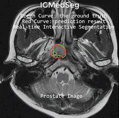

## IGMedSeg
This is the official PyTorch implementation of our paper "An Efficient Interactive Segmentation Framework for Medical Images Without Pre-Training".

The demo video can be found in ./demo-video.mp4.
## some examples

## run the code
the main file: /main/seg_tool.py